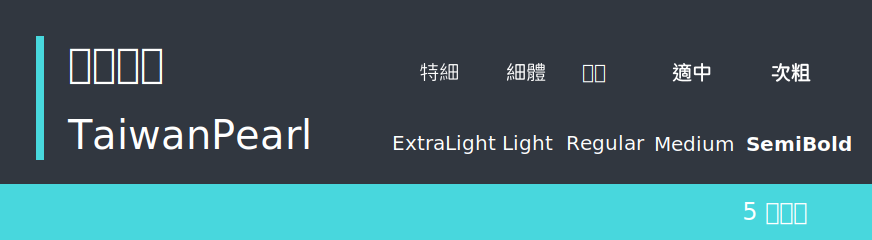

開源中文字體下載
======

&nbsp;

課程概要：
------
本章主要是我在網路上搜尋到一些可以開源並且可商用的中文字體供你們使用以及下載！！

&nbsp;

字體：
------

&nbsp;

### 1. 粉圓體

「jf open 粉圓字型」是基於 Kosugi Maru 改作，由 justfont 設計師針對台灣日常應用加以優化的開源字型。

[字體網站](https://justfont.com/huninn/)

&nbsp;

### 2. 台灣圓體

「台灣圓體」基於思源黑體與小杉圓體，大多的字是思源黑體為主，有部份的中文使用小杉圓體的中文字。

[字體網站](https://github.com/max32002/TaiwanPearl)

&nbsp;

### 3. 假粉圓體

「假粉圓體」是基於 jf open 粉圓的開放原始碼中文字型。

[字體網站](https://github.com/max32002/FakePearl)

&nbsp;

### 4. 源泉圓體

「源泉圓體」是基於思源黑體的開放原始碼中文字型。

[字體網站](https://github.com/ButTaiwan/gensen-font)

&nbsp;

### 5. 源石黑體

「源石黑體」是基於思源黑體的開放原始碼中文字型。

[字體網站](https://github.com/ButTaiwan/genseki-font)

&nbsp;

### 6. 源樣黑體

「源樣黑體」是基於思源黑體的開放原始碼中文字型。 
採用思源黑體韓文（KR）版本為主的字符，配合繁體中文慣用的置中標點，可排版傳統印刷體風格的文件。

[字體網站](https://github.com/ButTaiwan/genyog-font)

&nbsp;

### 7. 源雲明體

「源雲明體」是基於思源宋體的而改造的開放原始碼中文字型。

[字體網站](https://github.com/ButTaiwan/genwan-font)

&nbsp;

### 8. 源流明體

「源流明體」是基於思源宋體的而改造的開放原始碼中文字型。

[字體網站](https://github.com/ButTaiwan/genryu-font)

&nbsp;

### 9. 源樣明體

「源樣明體」是基於思源宋體的開放原始碼中文字型。 採用思源宋體韓文（KR）版本的字符，配合繁體中文慣用的置中標點，可排版傳統印刷體風格的文件。

[字體網站](https://github.com/ButTaiwan/genyo-font)

&nbsp;

### 10. 思源柔黑體 (源柔ゴシック)

Genju Gothic（Genju Gothic）是一種免費的OpenType字體，主要有分成三種不同的圓度以及每種都有７種字重，另外還有 Monospace (等寬字) 版本。

[字體網站](http://jikasei.me/font/genjyuu/)

&nbsp;

### 11. 獅尾圓體

獅尾圓體基於思源黑體的拔腳和加圓改造，更加簡明現代化的字體。支援简体中文、繁體中文、韓文與日文。

[字體網站](https://github.com/max32002/swei-gothic)

&nbsp;

### 12. 俊羽圓體

「俊羽圓體」是基於jf open 粉圓的開放原始碼中文字型。原本的構想是要挑戰把粉圓改成「羽逸体」，發現工程有點浩大，目前是半成品，聊勝於無，大家可以試用看看。也歡迎勇者接續修改，可以把修改好的寄給我，或直接在再開出新的字型名稱。
 
與粉圓體的差別在，橫線右上和左下角，有三角形的襯線，筆觸由原本的圓頭換成方頭，工程浩大在一個字、一個字改，曠日費時

[字體網站](https://github.com/max32002/YuPearl)

&nbsp;

### 13. 內海字體

「內海字體」是基於瀨戶字體的開放原始碼中文字型，目前字型內文字和符號字數在：34,657個。與原作者的版本，主要差異是另外新增4,137中文字，調整為5個字重，增加一些符號。

[字體網站](https://github.com/max32002/naikaifont)

&nbsp;

### 14. 清松手寫體

「清松手寫體」是游清松在稿紙上用原子筆手寫，透過「守寫字」網站產生出初稿字型檔，再透過字型軟體後製加工而成的手寫字型。

[字體網站](https://github.com/jasonhandwriting/JasonHandwriting)

&nbsp;

外部資源參考：
------

--- 文章參考 ---

* [UX vs UI vs IA vs IxD](https://uxplanet.org/ux-vs-ui-vs-ia-vs-ixd-4-confusing-digital-design-terms-defined-1ae2f82418c7)

--- 下章節介紹 ---

* [UI設計軟體 [XD]](https://github.com/Barry028/Ui-Design/tree/master/Lesson003%20-%20UI%E8%A8%AD%E8%A8%88%E8%BB%9F%E9%AB%94%20%5BXD%5D)
