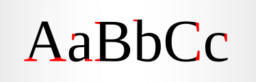
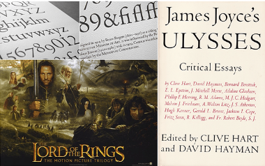
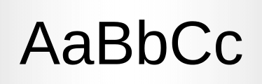
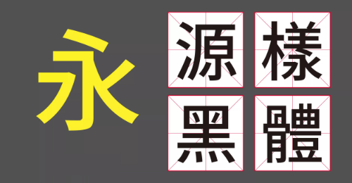
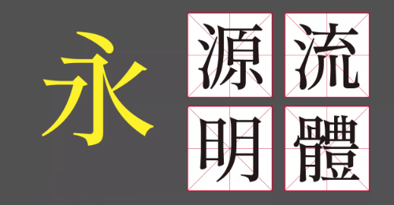
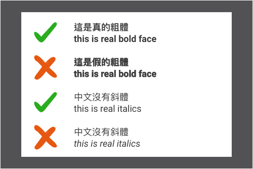
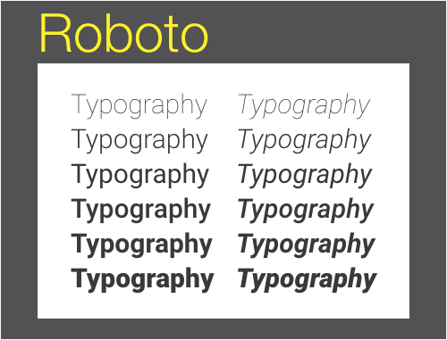
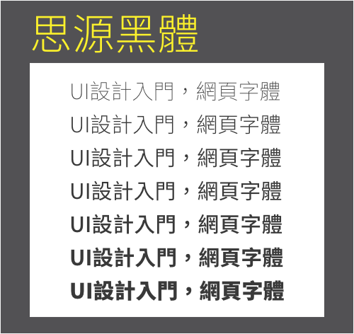

# 基本字型介紹

掌握基礎 **中文**、**英文** 字體知識，字體一直是設計師排版的關鍵之一，但由於網頁設計受到技術、法規、網路影響，在網頁上能夠使用的字體非常有限。

&nbsp;

## 字體分類：
字體因為外觀的關係而有不同的名稱，如：`黑體`、`明體`、`襯線`、`無襯線`等字體，以上或許大家都有聽過名稱，但不清楚外型（如果熟悉可以跳下一段），這裡就來解釋這些字體的分類及常見用途吧。

&nbsp;

### 英文：
英文文字大致分成三類「襯線體」、「無襯線體」和「其他字體」。其他字體包括哥特體，手寫體和裝飾體，这些字體在我們工作中使用相對較少，所以重點介紹襯線體和無襯線體兩大類。

#### 1.  Serif 襯線字體

* 外觀：字母的轉折處都會有小突起，且橫豎的粗細也不相同，看起來都會有古典感、歷史悠久的感覺。     
* 運用：帶有人文氣息，因此大多會運用在具有歷史、文學、文化的內容。

           
    襯線體的歷史比較悠久，是古羅馬時期的碑刻用字，適合用於表達傳統，典雅，高貴，距離感。  

    `-- 文章參考 --`        
    [Google fonts 的字體 Serif 篇](https://blog.justfont.com/2014/06/google-fonts-1/)

    <table style="table-layout:fixed ;border: none ;word-break: initial;  border-spacing: 12px;border-collapse: separate;text-align: center;">
        <tr style="border: none">
            <td style="width: 30%; border: none; padding: 10px 0 6px 0;background-color: #fff;border-bottom-color: #A4A6B6;border-bottom-style: double;border-bottom-width: medium">
                
            </td>
            <td style="width: 30%; border: none; padding: 10px 0 6px 0;background-color: #fff;border-bottom-color: #A4A6B6;border-bottom-style: double;border-bottom-width: medium;text-align: center;">
                
            </td>
           <td style="width: 30%; border: none; padding: 10px 0 6px 0;background-color: #fff;border-bottom-color: #A4A6B6;border-bottom-style: double;border-bottom-width: medium;text-align: center;">
                
            </td>
        </tr>
        <tr style="border: none;">
            <td style="border: none; background-color: #fff ;padding: 6px 4px 2px;">
                
            </td>
           <td style="border: none; background-color: #fff ;padding: 6px 4px 2px;">
                
            </td>
            <td style="border: none; background-color: #fff ;padding: 6px 4px 2px;">
                
            </td>
        </tr>
        <tr style="border: none ;vertical-align: top ;">
            <td style="border: none ;font-size: 14px ; padding: 2px 6px;">
                具有史詩般正統風格，特別適合用於表現年代悠久。具體排版時注意合字和老式數字的使用。
            </td>
            <td style="border: none ;font-size: 14px ; padding: 2px 6px;">
                復古傳統，沒有強烈個性，十分易於閱讀，因為太流行所以很多大的公司都做過Garamond復刻，蘋果電腦裡有系統字 Garamond 以及 Adobe 所製作的 Adobe Garamond Pro。 
            </td>
            <td style="border: none ;font-size: 14px ; padding: 2px 6px;">
                美國獨立宣言用字，是活字時代的大熱字體。很多公司也做過 Caslon 復刻，現在的使用也非常廣泛。
            </td>
        </tr>
    </table>

&nbsp;

&nbsp;

### 2. Sans Serif 無襯線字體

* 外觀：無論中英文皆沒有任何裝飾線。
* 運用：較無個性，帶給人科技、現代、正式的感覺，使用上非常廣泛。

&nbsp;

> -- 文章參考 -- [Google fonts 的字體（sans-serif 篇）](https://blog.justfont.com/2014/06/google-fonts-2/)

&nbsp;

中文部分則是稱為黑體及明體，外觀上明體接近於「歐文襯線字體」；黑體則接近於「歐文無襯線字體」。這兩者有許多文件會視為同類別（如：黑體 == 歐文無襯線字體），但也有許多專業設計師會視為不同類別，在此特別說明。

&nbsp;

### 3. 中文 - 黑體

* 外觀：粗細一致，以「切角」及「粗細分配」為造型重點

「黑體，就是將文字骨架加粗後，維持所有筆畫造型與視覺上的粗細一致，且起筆、收筆是切平的字體風格。」順帶一提，將「切平」改為「收圓」，就是圓體囉！

&nbsp;

> -- 文章參考 -- [黑體造型重點](https://blog.justfont.com/2018/08/jf-typeclass-intro-3/)

&nbsp;

### 4. 中文 - 明體

* 外觀：點如垂露、撇似刀、勾似鵝頭、捺如掃、口字上下多一段、橫尾有山、彎帶角，「中文筆劃造型」及「力道變化」是明體的造型特色。

&nbsp;

1. 明體造型源於書法楷書，是為了快速雕刻才簡化輪廓。它如刀痕的銳利筆劃，反映出雕刻體的風格。
2. 簡化橫筆、結尾有山，亦即橫筆收成一條細線，在尾巴有一座山的造型，是明體的最大特色。
3. 明體造型口訣：「點如垂露撇似刀，勾似鵝頭捺如掃。口字上下多一段，橫尾有山彎帶角。」

&nbsp;

> -- 文章參考 -- [明體造型重點](https://blog.justfont.com/2018/09/jf-typeclass-intro-4/)

&nbsp;

而系統上也都有包含預設襯線與無襯線所預設的中英文字體，除了上述兩種外系統內還有 Cursive(草書)、Fantasy(藝術字)、Monospace(等寬字)，但這些字體就並非有完全對應的中英文，實作上還是以襯線與無襯線兩種為主。

&nbsp;

## 避免用假粗體、假斜體：

在 office 軟體的設定中，i, B 兩個按鈕可以把任意字體變成斜體或粗體。如果一套字體裡真的有粗體、斜體那倒不會有問題（例如微軟正黑體有粗體）；但是如果缺乏粗體、斜體，就會用程式演算出來一個替代的版本。這其實不是一個字體最天然的設計。

&nbsp;

## 必要熟悉的系統字體：

目前常見的系統包含 Windows、MacOS、iOS、Android、Linux...等，每一種都還包含了中英文、襯線、無襯線等等（本篇以無襯線為主），而這些系統字體大不相同，更不會有自定的字體出現。

&nbsp;

### 1. Windows

使用人數最多的桌面作業系統（80%），無論是熬夜打電動、做作業、寫程式、畫 3D 都有不錯表現，因此所使用的系統絕對需要熟記～。

* 英文：在過去是使用 Arial，這款是仿造 Mac OS 的 Helvetica 字體所製作而成的，現在則是使用 Segoe UI。

* 中文字體：微軟正黑體，相當經典的黑體字，缺點是只有單一字重，缺乏較粗或較細的字體。

另外 Windows 系統預設的中文字體是「新細明體」，這款字體在單級數字級會有比較好的閱讀性（13px, 15px, 17px 字體顯示會較為銳利），但實作中還是以雙數字級（16px, 20px, 24px...）為主，使用上要特別注意。

&nbsp;

### 2. Mac OS / iOS

蘋果一直以來對於字體就非常要求，包含不同解析度、閱讀性、字重等等都很要求，現在的版本更提供專屬的中文字體，讓開發者、設計師、使用者都有很好的使用體驗。

* 英文：過去是使用 Helvetica Neue 的經典字體，現在無論是 iOS 或 Mac OS 均是使用 San Francisco，這款字體不會直接出現於繪圖軟體之中，如需可用前文連結另外安裝。

* 中文字體：現在是使用蘋方字體，這款是少見包含「多個字重」的中文系統字體（5 種），設計運用上自然能有更多的發揮空間。

&nbsp;

### 3. Android

Android 雖然有提供系統字體，但各家廠商製作手機時依然可以調整預設的系統字體，在此僅是提供主要的預設字體。

&nbsp;

* 英文：Roboto ，這一款字體運用上也是非常靈活，擁有 6 種字體且均另有斜體（italic，共 12 種），根據 Google Fonts 的統計，這個字體已經運用在 22,000,000 個網站上。

&nbsp;

* 中文字體：資料上顯示有兩款 Droidsansfallback 及 Noto Sans，Noto Sans 是 Google 與 Adobe 公司共同研發的開源字體，包含 7 種常用字重並且幾乎包含所有中文字，號稱最不會缺字的字體庫，目前是設計師必備的中文字體。

&nbsp;

另外提到，Noto Sans 是 Google 及 Adobe 合作的字體，在 Adobe 的服務中稱這套字體為「思源黑體」，在繁體中文的國家中，Noto Sans 基本上也是依據台灣官方規定的筆畫規則，是一款非常優秀的字體。

&nbsp;

## 結語：
了解預設字體是非常重要的，原因是「系統字體」是經過系統廠商所優化，普遍來說在各種情境都有較好的閱讀性；此外，每台電腦所安裝的字體也會有所不同，不可能要求一般用戶去下載未授權的字體，或是下載 Noto Sans 來做使用。

因此，使用第三方的字體可能會造成：

1. 可能缺乏良好的閱讀性（小字、色彩不明顯時）
2. 用戶並未安裝該字體，導致畫面不如預期
3. 缺字，導致字體顯示不一

&nbsp;

### 永字八法

側（點）、勒（橫書）、努（直筆）、趯（ㄊㄧˋ，鉤）、策（斜書向上之筆）、掠（撇）、啄（右短撇）、磔（捺）

&nbsp;

---

### 外部資源參考：

* --- 常見網路字體商 ---

    * [JUST FONT 就是字！](https://justfont.com/)

    * [GOOGLE FONTS](https://fonts.google.com/)

    * [文鼎科技](http://www.arphic.com.tw)

    * [華康字型](https://www.dynacw.com.tw/)

    * [ADOBE TYPEKIT](https://fonts.adobe.com/typekit)

* --- 部落格 ---

    * [JUST FONT 部落格](https://blog.justfont.com/)

* --- Facebook 社群 ---

    * [字戀](https://www.facebook.com/lovefonts/)

    * [字嗨過頭：字取其辱戀](https://www.facebook.com/groups/annoyfonts/)
> `字嗨社團會有很多字體高手在裡面分享文章及交流，很多人在路上看到很棒的字體會上去詢問是什麼字型之類的，建議加入！`

* --- 下章節介紹 ---
    * [開源中文字體下載](https://github.com/Barry028/Ui-Design/tree/master/Lesson002%20(2)%20-%20%E9%96%8B%E6%BA%90%E4%B8%AD%E6%96%87%E5%AD%97%E9%AB%94%E4%B8%8B%E8%BC%89)

