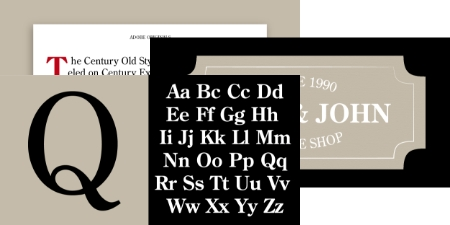
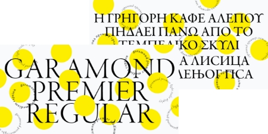
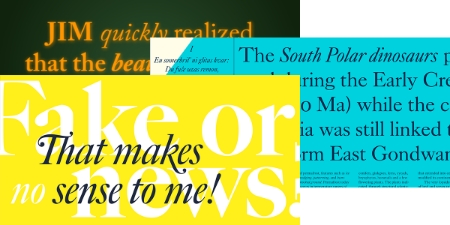

----- 請在上方下載檔案 -----

:book: Unit 1-02 - 基本字型介紹
-----------------------
掌握基礎 <big> **中文** </big>、<big> **英文** </big> 字體知識，字體一直是設計師排版的關鍵之一，但由於網頁設計受到技術、法規、網路影響，在網頁上能夠使用的字體非常有限。

&nbsp;

### :bookmark: 課程內容
 - [中英文字型類別](#%E4%B8%AD%E8%8B%B1%E6%96%87%E5%AD%97%E5%9E%8B%E9%A1%9E%E5%88%A5)
 - [避免用假粗體、假斜體](#%E9%81%BF%E5%85%8D%E7%94%A8%E5%81%87%E7%B2%97%E9%AB%94%E3%80%81%E5%81%87%E6%96%9C%E9%AB%94)
 - [必要熟悉的系統字體](#%E5%BF%85%E8%A6%81%E7%86%9F%E6%82%89%E7%9A%84%E7%B3%BB%E7%B5%B1%E5%AD%97%E9%AB%94)
 - [永字八法](#%E6%B0%B8%E5%AD%97%E5%85%AB%E6%B3%95)
 - [結語](#%E7%B5%90%E8%AA%9E)
 - [外部資源參考](#%E5%A4%96%E9%83%A8%E8%B3%87%E6%BA%90%E5%8F%83%E8%80%83)
 
 &nbsp;

### :pushpin: 中英文字型類別
  字體因為外觀的關係而有不同的名稱，如：`黑體`、`明體`、`襯線`、`無襯線`等字體，以上或許大家都有聽過名稱，但不清楚外型 <small>（如果熟悉可以跳下一段）</small>，這裡就來解釋這些字體的分類及常見用途吧。

  * #### 英文
    
    英文文字大致分成三類「襯線體」、「無襯線體」和「其他字體」。其他字體包括哥特體，手寫體和裝飾體，这些字體在我們工作中使用相對較少，所以重點介紹襯線體和無襯線體兩大類。

    ##### 1.  Serif 襯線字體
    
      * **外觀**：字母的轉折處都會有小突起，且橫豎的粗細也不相同，看起來都會有古典感、歷史悠久的感覺。
      * **運用**：帶有人文氣息，因此大多會運用在具有歷史、文學、文化的內容。
      
      

      &nbsp;

      <kbd>  </kbd>
      <kbd>  </kbd>
      <kbd>  </kbd>

      `襯線體的歷史比較悠久，是古羅馬時期的碑刻用字，適合用於表達傳統，典雅，高貴，距離感。`  

      &nbsp;
    
    ##### 2. Sans Serif 無襯線字體
    
      * **外觀**：無論中英文皆沒有任何裝飾線
      * **運用**：較無個性，帶給人科技、現代、正式的感覺，使用上非常廣泛。
        
      

      &nbsp;

  * #### 中文
    
    中文部分則是稱為黑體及明體，外觀上明體接近於「歐文襯線字體」；黑體則接近於「歐文無襯線字體」。這兩者有許多文件會視為同類別（如：黑體 = 歐文無襯線字體），但也有許多專業設計師會視為不同類別，在此特別說明。

    ##### 1. 中文 - 黑體

      * **外觀**：粗細一致，以「切角」及「粗細分配」為造型重點。  
        
      

      「黑體，就是將文字骨架加粗後，維持所有筆畫造型與視覺上的粗細一致，且起筆、收筆是切平的字體風格。」順帶一提，將「切平」改為「收圓」，就是圓體囉！

    ##### 2. 中文 - 明體

      * **外觀**：點如垂露、撇似刀、勾似鵝頭、捺如掃、口字上下多一段、橫尾有山、彎帶角，「中文筆劃造型」及「力道變化」是明體的造型特色。
        
        
        
        +  明體造型源於書法楷書，是為了快速雕刻才簡化輪廓。它如刀痕的銳利筆劃，反映出雕刻體的風格。
        + 簡化橫筆、結尾有山，亦即橫筆收成一條細線，在尾巴有一座山的造型，是明體的最大特色。  
        + **明體造型口訣**：「點如垂露撇似刀，勾似鵝頭捺如掃。口字上下多一段，橫尾有山彎帶角。」

        而系統上也都有包含預設襯線與無襯線所預設的中英文字體，除了上述兩種外系統內還有 Cursive (草書)、Fantasy (藝術字)、Monospace (等寬字)，但這些字體就並非有完全對應的中英文，實作上還是以襯線與無襯線兩種為主。

    &nbsp;

### :pushpin: 避免用假粗體、假斜體
  在 Office 軟體的設定中，<kbd>I</kbd> <kbd>B</kbd> 兩個按鈕可以把任意字體變成斜體或粗體。
  如果一套字體裡真的有粗體、斜體那倒不會有問題（例如微軟正黑體有粗體）；但是如果缺乏粗體、斜體，就會用程式演算出來一個替代的版本。這其實不是一個字體最天然的設計。  

    

  &nbsp;

### :pushpin: 必要熟悉的系統字體
  目前常見的系統包含 Windows、MacOS、iOS、Android、Linux ...等，每一種都還包含了中英文、襯線、無襯線等等（本篇以無襯線為主），而這些系統字體大不相同，更不會有自定的字體出現。

   * #### Windows
     
     使用人數最多的桌面作業系統（80%），無論是熬夜打電動、做作業、寫程式、畫 3D 都有不錯表現，因此所使用的系統絕對需要熟記～。

      * 英文：在過去是使用 Arial，這款是仿造 Mac OS 的 Helvetica 字體所製作而成的，現在則是使用 Segoe UI。
      * 中文字體：微軟正黑體，相當經典的黑體字，缺點是只有單一字重，缺乏較粗或較細的字體。
        
        另外 Windows 系統預設的中文字體是「新細明體」，這款字體在單級數字級會有比較好的閱讀性（13px, 15px, 17px 字體顯示會較為銳利），但實作中還是以雙數字級（16px, 20px, 24px...）為主，使用上要特別注意。

   * #### Mac OS / iOS
    
      蘋果一直以來對於字體就非常要求，包含不同解析度、閱讀性、字重等等都很要求，現在的版本更提供專屬的中文字體，讓開發者、設計師、使用者都有很好的使用體驗。

      * 英文：過去是使用 Helvetica Neue 的經典字體，現在無論是 iOS 或 Mac OS 均是使用 San Francisco，這款字體不會直接出現於繪圖軟體之中，如需可用前文連結另外安裝。
      * 中文字體：現在是使用蘋方字體，這款是少見包含「多個字重」的中文系統字體（5 種），設計運用上自然能有更多的發揮空間。
      
   * #### Android
    
      Android 雖然有提供系統字體，但各家廠商製作手機時依然可以調整預設的系統字體，在此僅是提供主要的預設字體。

      
      > 英文：Roboto ，這一款字體運用上也是非常靈活，擁有 6 種字體且均另有斜體（italic，共 12 種），根據 Google Fonts 的統計，這個字體已經運用在 22,000,000 個網站上。
    
      
      > 中文字體：資料上顯示有兩款 Droidsansfallback 及 Noto Sans，Noto Sans 是 Google 與 Adobe 公司共同研發的開源字體，包含 7 種常用字重並且幾乎包含所有中文字，號稱最不會缺字的字體庫，目前是設計師必備的中文字體。

      另外提到，Noto Sans 是 Google 及 Adobe 合作的字體，在 Adobe 的服務中稱這套字體為「思源黑體」，在繁體中文的國家中，Noto Sans 基本上也是依據台灣官方規定的筆畫規則，是一款非常優秀的字體。

  &nbsp;

### :pushpin: 永字八法
    
  `側（點）、勒（橫書）、努（直筆）、趯（ㄊㄧˋ，鉤）、策（斜書向上之筆）、掠（撇）、啄（右短撇）、磔（捺）`

  &nbsp;

### :pushpin: 結語
  了解預設字體是非常重要的，原因是「系統字體」是經過系統廠商所優化，普遍來說在各種情境都有較好的閱讀性；此外，每台電腦所安裝的字體也會有所不同，不可能要求一般用戶去下載未授權的字體，或是下載 Noto Sans TC 來做使用。

  因此，使用第三方的字體可能會造成：  

  1. 可能缺乏良好的閱讀性 <small>（小字、色彩不明顯時）</small>
  2. 用戶並未安裝該字體，導致畫面不如預期  
  3. 缺字，導致字體顯示不一

  &nbsp;

---

### :pushpin: 外部資源參考

- --- 常見網路字體商 ---
  - [JUST FONT 就是字！](https://justfont.com/)
  - [GOOGLE FONTS](https://fonts.google.com/)
  - [文鼎科技](http://www.arphic.com.tw)
  - [華康字型](https://www.dynacw.com.tw/)
  - [ADOBE TYPEKIT](https://fonts.adobe.com/typekit)
- --- 部落格 ---
  - [JUST FONT 部落格](https://blog.justfont.com/)
- --- Facebook 社群 ---
  - [字戀](https://www.facebook.com/lovefonts/)
  - [字嗨過頭：字取其辱戀](https://www.facebook.com/groups/annoyfonts/)  
    `字嗨社團會有很多字體高手在裡面分享文章及交流，很多人在路上看到很棒的字體會上去詢問是什麼字型之類的，建議加入！`
- --- 下章節介紹 ---
  - [開源中文字體下載](<https://github.com/Barry028/Ui-Design/tree/master/Lesson002%20(2)%20-%20%E9%96%8B%E6%BA%90%E4%B8%AD%E6%96%87%E5%AD%97%E9%AB%94%E4%B8%8B%E8%BC%89>)
