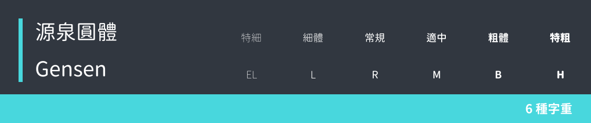
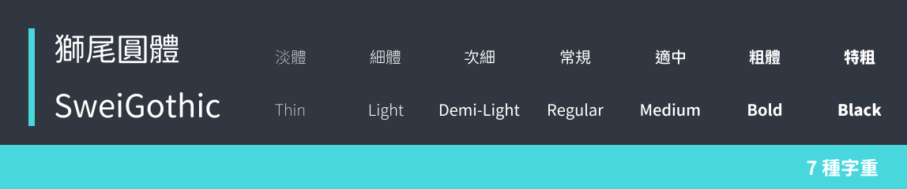
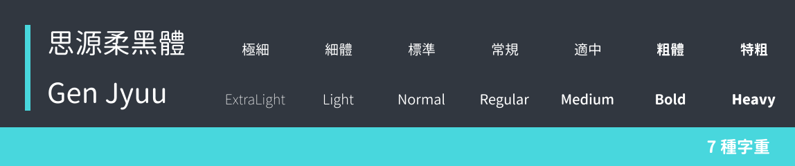
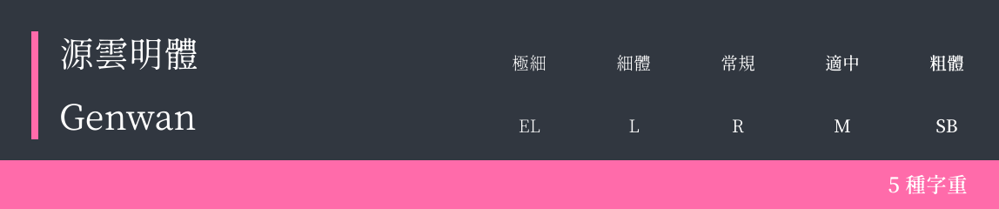
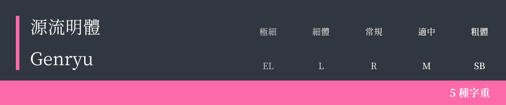
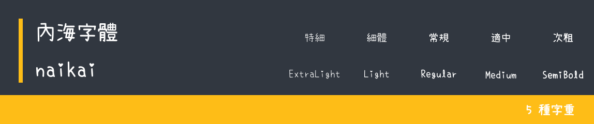
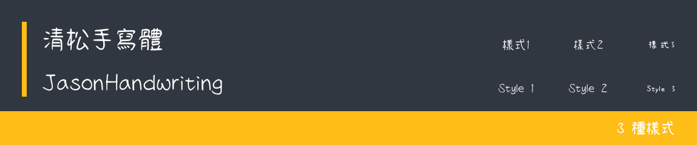
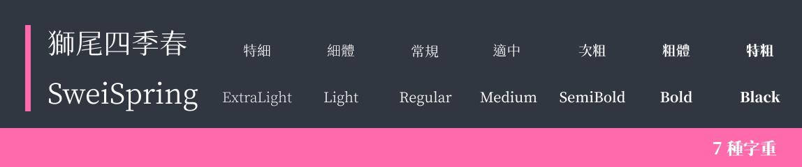

----- 請在上方下載檔案 -----

## :book: Unit 1-03 - 開源中文字體下載
主要是搜集了一些 **開源/免費/可商用** 的字體，供一開始練習的時候使用，一方面也給我自己記錄一下！
> 為了安全，使用字體前要看官方條款才準確喔。

&nbsp;

### :bookmark: 本章大綱
 - [圓體](#%E5%9C%93%E9%AB%94)
 - [黑體](#%E9%BB%91%E9%AB%94)
 - [明體](#%E6%98%8E%E9%AB%94)
 - [其他](#%E5%85%B6%E4%BB%96)
 - [外部資源參考](#%E5%A4%96%E9%83%A8%E8%B3%87%E6%BA%90%E5%8F%83%E8%80%83)

 &nbsp;

### :pushpin: 圓體
 * #### 粉圓體
    
    
    「jf open 粉圓字型」是基於 Kosugi Maru 改作，由 justfont 設計師針對台灣日常應用加以優化的開源字型。

    [字體網站](https://justfont.com/huninn/)

 * #### 圓體
   
    
    「台灣圓體」基於思源黑體與小杉圓體，大多的字是思源黑體為主，有部份的中文使用小杉圓體的中文字。

    [字體網站](https://github.com/max32002/TaiwanPearl)

 * #### 假粉圓體
   
    
   「假粉圓體」是基於 jf open 粉圓的開放原始碼中文字型。
    
    [字體網站](https://github.com/max32002/FakePearl)

 * #### 源泉圓體
    
    
   「源泉圓體」是基於思源黑體的開放原始碼中文字型。

    [字體網站](https://github.com/ButTaiwan/gensen-font)

 * #### 獅尾圓體
    
    

    獅尾圓體基於思源黑體的拔腳和加圓改造，更加簡明現代化的字體。支援简体中文、繁體中文、韓文與日文。

    [字體網站](https://github.com/max32002/swei-gothic)
	
 * #### 俊羽圓體
    
    

     「俊羽圓體」是基於 jf open 粉圓的開放原始碼中文字型。原本的構想是要挑戰把粉圓改成「羽逸体」，發現工程有點浩大，目前是半成品，聊勝於無，大家可以試用看看。也歡迎勇者接續修改，可以把修改好的寄給我，或直接在再開出新的字型名稱。
     與粉圓體的差別在，橫線右上和左下角，有三角形的襯線，筆觸由原本的圓頭換成方頭，工程浩大在一個字、一個字改，曠日費時

     [字體網站](https://github.com/max32002/YuPearl)

### :pushpin: 黑體
 * #### 源石黑體
    
    
    「源石黑體」是基於思源黑體的開放原始碼中文字型。

    [字體網站](https://github.com/ButTaiwan/genseki-font)

 * #### 源樣黑體
   
    

    「源樣黑體」是基於思源黑體的開放原始碼中文字型。
    採用思源黑體韓文（KR）版本為主的字符，配合繁體中文慣用的置中標點，可排版傳統印刷體風格的文件。
	
    [字體網站](https://github.com/ButTaiwan/genyog-font)

 * #### 思源柔黑體 (源柔ゴシック)
    
    

    Genju Gothic（Genju Gothic）是一種免費的 OpenType 字體，主要有分成三種不同的圓度以及每種都有７種字重，另外還有 Monospace (等寬字) 版本。

    [字體網站](http://jikasei.me/font/genjyuu/)

### :pushpin: 明體
 * #### 源雲明體
	
    

	  源雲明體」是基於思源宋體的而改造的開放原始碼中文字型。
	
	  [字體網站](https://github.com/ButTaiwan/genwan-font)

 * #### 源流明體

    
	
	  「源流明體」是基於思源宋體的而改造的開放原始碼中文字型。
	
	  [字體網站](https://github.com/ButTaiwan/genryu-font)

 * #### 源樣明體
    
    

    「源樣明體」是基於思源宋體的開放原始碼中文字型。 採用思源宋體韓文（KR）版本的字符，配合繁體中文慣用的置中標點，可排版傳統印刷體風格的文件。

    [字體網站](https://github.com/ButTaiwan/genyo-font)

### :pushpin: 其他
 * #### 內海字體
    
    

     「內海字體」是基於瀨戶字體的開放原始碼中文字型，目前字型內文字和符號字數在：34,657 個。與原作者的版本，主要差異是另外新增 4,137 中文字，調整為 5 個字重，增加一些符號。
		
		 [字體網站](https://github.com/max32002/naikaifont)
	
 * #### 清松手寫體
   
    

     「清松手寫體」是游清松在稿紙上用原子筆手寫，透過「守寫字」網站產生出初稿字型檔，再透過字型軟體後製加工而成的手寫字型。

     [字體網站](https://github.com/jasonhandwriting/JasonHandwriting)

 * #### 獅尾四季春
   
    

     「獅尾四季春」字體基於思源宋體的拔三角形改造，更加簡明現代化的字體。支援简体中文、繁體中文、韓文與日文。

     [字體網站](https://github.com/max32002/swei-spring)

### :pushpin: 外部資源參考
- --- 文章參考 ---
	+ [UX vs UI vs IA vs IxD](https://uxplanet.org/ux-vs-ui-vs-ia-vs-ixd-4-confusing-digital-design-terms-defined-1ae2f82418c7)
- --- 下章節介紹 ---
	+ [UI 設計軟體 [XD]](https://github.com/Barry028/Ui-Design/tree/master/Lesson003%20-%20UI%E8%A8%AD%E8%A8%88%E8%BB%9F%E9%AB%94%20%5BXD%5D)
