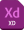

----- 請在上方下載課程範例檔及簡報 -----

# ADOBE XD 介紹
  Adobe XD 是一個專業的設計工具，專為設計師和創意人士打造，用於創建各種界面設計、原型和互動設計。

## 範例檔內含：

| <h4><b>檔案名稱</b> `FILE`</h4> 	              | <h4> <b>下載連結</b> `DOWNLOAD LINK` </h4>   |
| :-----------------------------------------------| :-------------------------------------------|
|   <b>ADOBE XD</b> 基本介紹    | [**下載 Download**](XD介紹.pdf)   				   |
|    <b>ADOBE XD</b> 簡報檔案    | [**下載 Download**](XD介紹.xd)   				   |			

---
## 課程概要：
1. UI 設計軟體
2. XD 工具欄介紹
3. XD 基本常用操作
4. XD 常用快捷鍵

---
## 重點回顧：
### 一、 UI 設計軟體
目前常見 **UI 設計軟體** 主要為：		

  
> 	**優點：**  
> 	Plugin多、Mac only (好像不算優點？)、Components View (Beta) 簡單明瞭、訂閱期間結束後可繼續使用原版本。	

  
> 	**優點：**  
> 	跨平台 (Mac & Windows)、免費 (提供一個 co-editor 跟 shared document)、AI & PS 相容性、版本可持續更新。

  
> 	**優點：**  
> 	跨平台 (Mac & Windows & Linux 系統可開啟)、網頁隨開隨用、免費、預覽 Css Code、即時溝通、版本可持續更新。

--- 
### 二、 XD 基本工具列介紹
左側的工具列是軟體內的基本工具，當操作動任何作後請記得返回`選取工具`，
只要記得動作完後按 <kbd>V</kbd> 或 <kbd>Esc</kbd> 都會回到`選取工具`。

#### 1. 選取工具	`SELECT` <kbd>V</kbd>
> ##### 基本上是操作 Adobe Xd   的一個起手式，可以避免手殘按成其他繪製狀態，並可隨時點選需要的物件或功能。
> * 單擊滑鼠左鍵能夠對物件作`移動`、`縮放`的動作。
> * 雙擊滑鼠左鍵進入物件的`編輯模式`。 

#### 2. 矩形工具 `RECTANGLE` <kbd>R</kbd>
> ##### 常見於 Header、Button 製作等，拉出四邊形後輕曳四角可以拉出圓角。
> * 繪製`矩形`，能隨意拉出不同`大小的矩形`。  

#### 3. 圓形工具	`ELLIPSE` <kbd>E</kbd>
> ##### 常見於製作 iCon、User、Avatar 等，透過漸層色可搭配出多變的視覺。
> * 繪製`圓形`，能隨意拉出不同`大小的圓形`。

#### 4. 多邊形工具 `POLYGON` <kbd>Y</kbd>
> ##### 繪製多邊形狀，從三角形開始，可在右側工作面板區域編輯繳的數量。
> * 繪製`多邊形`，創建各種新形狀，例如：`三角形`、`菱形`、`五邊形`、`星形`和`心形`。

#### 5. 線段工具 `LINE` <kbd>L</kbd>
> ##### 若覺得介面太單調，在段落之間畫一條線調低透明度往往有不錯的效果。需注意的是 Line 是建立在 Border 上，不是填充色。
> * 繪製`直線`，隨意拉出不同長度的`線段`。

#### 6. 鋼筆工具 `PEN` <kbd>P</kbd>
> ##### 用習慣 Illustrator 的人更好上手，可以用來畫出任何你想要的形狀，其運算原理就是高中數學課的`貝茲曲線`，要做好向量檔圖形必會技能。
> 
> * 使用`鋼筆工具`可繪製的最簡單的路徑是直線，通過單擊`鋼筆工具`以創建兩個`錨點`即可。繼續單擊可創建由角點連接的直線段組成的路徑。
> > ###### 點回`選擇工具`或者按下鍵盤 <kbd>Esc</kbd> 退出`鋼筆工具`。

#### 7. 文字工具 `TEXT` <kbd>T</kbd>
> * 不管是設計網頁或 App 等，文字編排的組成佔了大宗，拉出來的文字區塊可利用周圍調整大小至適合的排版位置。  
> > ###### 選擇文字工具時，指標會變成一個 **I** 形文字光標。使用此指標來插入和`編輯文字元素`。

#### 8. 畫板工具 `ARTBOARD` <kbd>A</kbd>
> * Artboard，設計產品的畫面，能隨意拉出不同`頁面尺寸`進行設計 (單位為 PX) <kbd>I</kbd> 吸取)  
> > ###### 點擊後可利用鼠標拉出自訂大小的畫布 (Artboard)，或是從右側邊欄選擇常見裝置尺寸。

#### 9. 放大鏡 `ZOOM` <kbd>Z</kbd>
> *  放大 <kbd>⌘</kbd> + <kbd>+</kbd>
> *  缩小 <kbd>⌘</kbd> + <kbd>-</kbd>
> *  縮放 <kbd>⌘</kbd> 滑鼠滾輪	 <kbd>↕</kbd>
> > ###### 功能使用上述快捷鍵比較方便，透過`鍵盤`操作或者`鍵盤`+`滑鼠`使用 縮放工具。任意`縮放工作區域`，例如需要將畫面拉近看細節或者需要拉遠看整體感覺之類的。

#### 10. 滴管工具 `EYEDROPPER` <kbd>I</kbd>
吸取其他螢幕或者軟體中的顏色當作此形狀的`填充顏色` (邊框顏色無法使用快捷鍵 <kbd>I</kbd> 吸取)。

---
### 三、 XD 基本常用操作

---
### 四、 XD 常用快捷鍵

### 第二層「雙鍵動作」
#### Command (Ctrl) + "~"
可快速切換不同 `.xd `檔案，在多工操作情況下省時省力。

#### Command (Ctrl) + "3"
狙擊。選定物件後縮放至適合大小。

#### Command (Ctrl) + "0"
望遠鏡。可一次綜覽所有 Artboard。

#### Command (Ctrl) + "-"
縮放讓視野往後看一點。

#### Command (Ctrl) + "E"
#### 匯出選擇的 Artboard 或物件。
縮放用兩指划動觸控板或 按 Option(Alt) 後滾動滑鼠滾輪也可

#### Command (Ctrl) + "Q"
結束 Adobe Xd，不要拿來開同事玩笑。

#### Command (Ctrl) + "W"
關閉目前 Adobe Xd 專案。

#### Command (Ctrl) + "E"
匯出目前選擇的 Artboard 或 物件。

#### Command (Ctrl) + "R"
製作 Repeat Grid 。 **Adobe Xd 重點功能**

#### Command (Ctrl) + "Y"
顯示 / 關閉圖層列。

#### Command (Ctrl) + "S"
儲存目前檔案，在台灣地震時需反射動作使用。

#### Command (Ctrl) + "G"
比選起來的多個物件群組起來。

#### Command (Ctrl) + "K"
將當前物件儲存為 Symbol。

#### Command (Ctrl) + "L"
將當前物件鎖起來不能動。

#### Command (Ctrl) + ";"
將當前物件隱藏或顯示。

#### Command (Ctrl) + "Return (Enter)"
預覽 (Peview) 目前的設計稿。

#### Command (Ctrl) + "Z"
回到上一步驟。

#### Command (Ctrl) + "C"
複製。

#### Command (Ctrl) + "V"
貼上。

#### Command (Ctrl) + "N"
開啟新的 `.xd` 專案。

### 第三層「三鍵組合技」
#### Command (Ctrl) + Shift + T
將目前文字樣式儲存進 Assets。

#### Command (Ctrl) + Shift + S
另存新檔。

#### Command (Ctrl) + Shift + G
解散群組。

#### Command (Ctrl) + Shift + Z
還原「回到上一動」指令。

#### Command (Ctrl) + Shift + C
將當前物件顏色儲存至 Assets。

#### Command (Ctrl) + Shift + M
將多形狀或照片重疊後，製作剪裁遮色片 (Mask With Shape)。

---

## 外部資源參考：
------
--- UI KIT --- 
* [XDguru](https://www.xdguru.com/adobe-xd-ui-kits/)
* [Sketchappsources](https://www.sketchappsources.com/category/mobile.html)
--- ICON --- 
* [Flaticon ICON網站](https://www.flaticon.com/)
--- 設計素材 --- 
* [Freepik 素材網站](https://www.freepik.com/home)