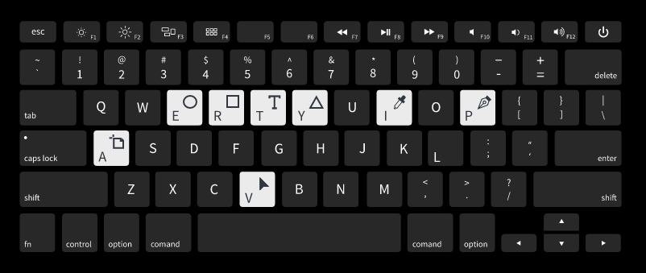
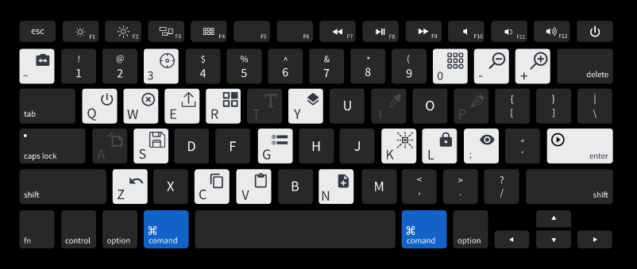
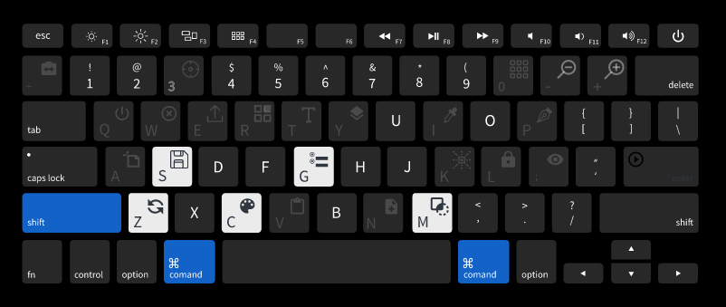

----- 請在上方下載課程範例檔及簡報 -----
ADOBE XD 介紹
======

&nbsp;

範例檔內含：
------

1. [ADOBE XD 介紹 PDF](XD介紹.pdf)

2. [ADOBE XD 製作的原始簡報檔案](XD介紹.xd)

&nbsp;

課程概要：
------

1. 常見的 UI 設計軟體

2. XD 操作工具介紹

3. XD 基本常用操作

4. XD 常用快捷鍵

&nbsp;

重點回顧：
------
* 目前常見 UI設計軟體為：

1. Sketch   -  https://www.sketch.com/

2. Adobe XD -  https://www.adobe.com/tw/products/xd.html

3. Figma    -  https://www.figma.com/

&nbsp;

* XD 元件庫、圖層、外掛

* XD 畫板設定 (網格系統)

* XD 快捷鍵的認識 

&nbsp;

### 第一層「單鍵工具」
#### 「V」選取
基本上是操作 Adobe Xd 的一個起手式，可以避免手殘按成其他繪製狀態，並可隨時點選我要的物件。

#### 「A」新增工作區域增
點擊後可利用鼠標拉出自訂大小的畫布 (Artboard)，或是從右側邊欄選擇常見裝置尺寸。

#### 「E」繪製圓形
常見於製作 icon 、user avatar等，透過漸層色可搭配出多變的視覺。

#### 「R」繪製四邊形
常見於 header 、button製作等，拉出四邊形後輕曳四角可以拉出圓角。

#### 「Y」繪製多邊形
繪製多邊形狀，從三角形開始，可在右側編輯邊線數。

#### 「L」繪製直線
若覺得介面太單調，在段落之間畫一條線調低透明度往往有不錯的效果。需注意的是 Line 是建立在 border 上，不是填充色。

#### 「P」鋼筆工具
用習慣 Illustrator 的人更好上手，可以用來畫出任何你想要的形狀，其運算原理就是高中數學課的 "貝茲曲線"，要做好向量檔圖形必會技能。

#### 「T」文字工具
不管是設計網頁或App等，文字編排的組成佔了大宗，拉出來的文字區塊可利用周圍調整大小至適合的排版位置。

#### 「I」吸管
可以吸取其他地方的顏色當作此形狀的顏色 (邊框無法使用快捷鍵吸取)

&nbsp;

### 第二層「雙鍵動作」
#### Command (Ctrl) + "~"
可快速切換不同 .xd 檔案，在多工操作情況下省時省力。

#### Command (Ctrl) + "3"
狙擊。選定物件後縮放至適合大小。

#### Command (Ctrl) + "0"
望遠鏡。可一次綜覽所有 Artboard。

#### Command (Ctrl) + "-"
縮放讓視野往後看一點。

#### Command (Ctrl) + "E"
#### 匯出選擇的 Artboard 或物件。
縮放用兩指划動觸控板或 按 option(alt) 後滾動滑鼠滾輪也可

#### Command (Ctrl) + "Q"
結束 Adobe Xd，不要拿來開同事玩笑。

#### Command (Ctrl) + "W"
關閉目前 Adobe Xd 專案。

#### Command (Ctrl) + "E"
匯出目前選擇的 Artboard 或 物件。

#### Command (Ctrl) + "R"
製作 Repeat Grid 。
* Adobe Xd 重點功能 *

#### Command (Ctrl) + "Y"
顯示 / 關閉圖層列。

#### Command (Ctrl) + "S"
儲存目前檔案，在台灣地震時需反射動作使用。

#### Command (Ctrl) + "G"
比選起來的多個物件群組起來。

#### Command (Ctrl) + "K"
將當前物件儲存為 symbol。

#### Command (Ctrl) + "L"
將當前物件鎖起來不能動。

#### Command (Ctrl) + ";"
將當前物件隱藏或顯示。

#### Command (Ctrl) + "return (enter)"
預覽(preview)目前的設計稿。

#### Command (Ctrl) + "Z"
回到上一步驟。

#### Command (Ctrl) + "C"
複製。

#### Command (Ctrl) + "V"
貼上。

#### Command (Ctrl) + "N"
開啟新的 .xd 專案。

&nbsp;

### 第三層「三鍵組合技」
#### Command (Ctrl) + Shift + T
將目前文字樣式儲存進 Assets。

#### Command (Ctrl) + Shift + S
另存新檔。

#### Command (Ctrl) + Shift + G
解散群組。

#### Command (Ctrl) + Shift + Z
還原「回到上一動」指令。

#### Command (Ctrl) + Shift + C
將當前物件顏色儲存至 Assets。

#### Command (Ctrl) + Shift + M
將多形狀或照片重疊後，製作剪裁遮色片 (Mask with shape)。

&nbsp;

外部資源參考：
------

--- UI KIT --- 

* [XDguru](https://www.xdguru.com/adobe-xd-ui-kits/)

* [Sketchappsources](https://www.sketchappsources.com/category/mobile.html)

--- ICON --- 

* [Flaticon ICON網站](https://www.flaticon.com/)

--- 設計素材 --- 

* [Freepik 素材網站](https://www.freepik.com/home)
